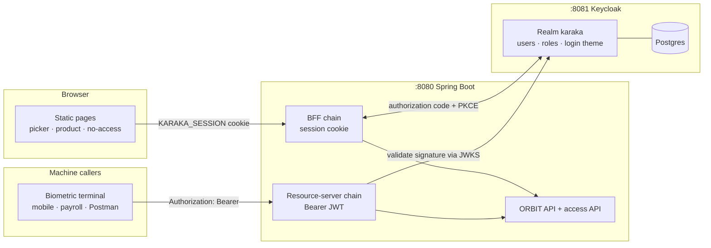
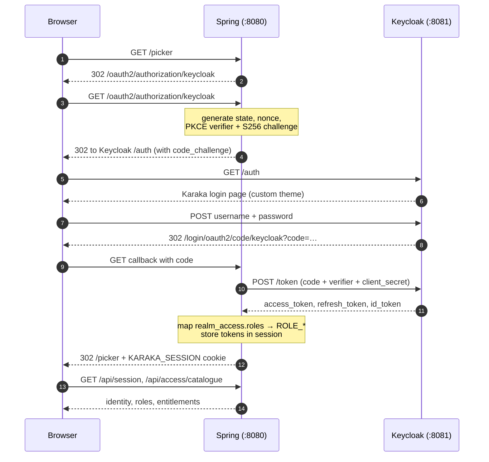
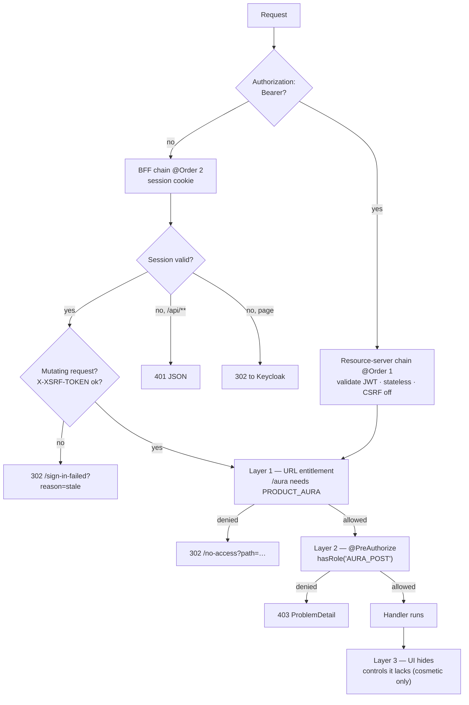
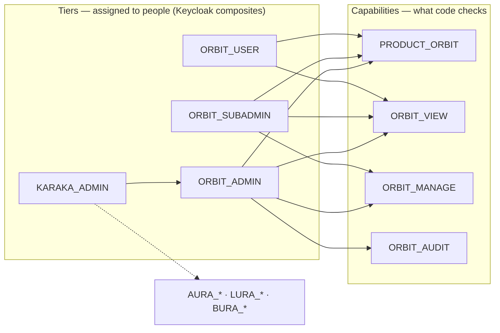
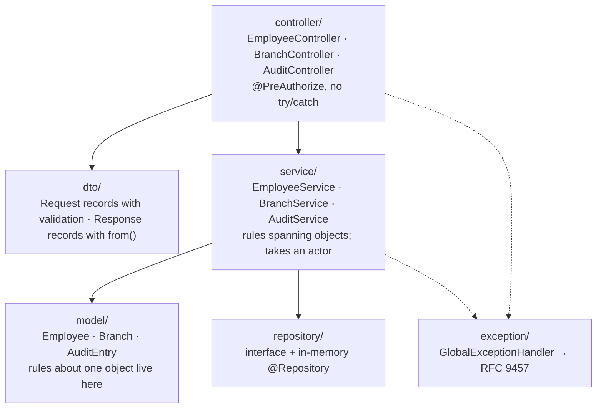

# Karaka — Keycloak SSO across a product suite

Karaka is a suite of peer products sharing **one login** and **one visual system**. The
name comes from Sanskrit grammar: a *kāraka* is "the agent that brings the action about",
the relation everything else in a sentence refers back to.

This repository is a **working end-to-end demonstration** of role-based access control for
that suite, using Keycloak as the identity provider and a Spring Boot
backend-for-frontend. Four products are modelled — ORBIT, AURA, LURA, BURA — of which
ORBIT has a real API. The others exist to show that a user sees exactly their own slice
and nothing more.

| | |
|---|---|
| Keycloak | 26.3 (Quarkus distribution), Postgres 16 |
| Service | Spring Boot **4.1.0** (Framework 7, Security 7) on **Java 25**, Maven, Lombok |
| Frontend | Static HTML, no framework, no build step |
| Verified | 24 automated tests, plus the live matrix in [Verified behaviour](#verified-behaviour) |

---

## Quick start

```bash
cp .env.example .env          # then change the values
./scripts/local-up.sh         # Postgres -> Keycloak -> providers -> service
```

Then open <http://localhost:8080/> and sign in as `ankit` with your `DEMO_USER_PASSWORD`.

`local-up.sh` is a composition root: its only job is **ordering**, and every step is
delegated to the script that owns it. The order is not cosmetic — each rule below is a
failure that has actually happened here:

1. **Postgres before Keycloak** — Keycloak's Liquibase migration aborts if the database is
   not accepting connections, and the container exits rather than retrying.
2. **Keycloak before the service** — Spring resolves `issuer-uri` **eagerly** at boot, so a
   service started first dies on discovery instead of waiting for it.
3. **Realm import before provider reconciliation** — the Admin API needs the realm to exist.

| Flag | When |
|---|---|
| *(none)* | converge the running stack; safe to re-run |
| `--fresh` | drop the Keycloak database and rebuild from `.env` — **the only way realm-template edits take effect**, because `--import-realm` is `IGNORE_EXISTING` |
| `--build` | rebuild the service jar first |

A full `--fresh` run reproduces the entire stack — realm, policy, demo users and Google
sign-in — from git plus `.env` in about 20 seconds. Nothing is recovered by hand.

The individual scripts remain independently runnable; `local-up.sh` adds no behaviour of
its own. The realm file holds no credentials in git — see [docs/DEPLOY.md](docs/DEPLOY.md).

| URL | What it is |
|---|---|
| <http://localhost:8080/> | The suite. Redirects to the Keycloak login page |
| <http://localhost:8081/admin> | Keycloak admin console (`admin` / your `.env` password) |
| <http://localhost:8081/realms/karaka/account> | Keycloak's end-user self-service console |

### Demo accounts

| User | Assigned tiers | Can enter |
|---|---|---|
| `ankit` | `KARAKA_ADMIN` | all four products, every capability |
| `harsh` | `ORBIT_SUBADMIN`, `AURA_ADMIN` | ORBIT (no audit trail), AURA (full) |
| `meera` | `ORBIT_USER`, `AURA_SUBADMIN` | ORBIT read-only, AURA post but not close |
| `monti` | `AURA_USER` | AURA read-only, nothing else |
| `farhan` | `LURA_USER`, `BURA_USER` | LURA + BURA read-only |
| `priya` | *none* | nothing — every tile locked |

Sign in as `ankit`, then as `monti`, and compare. That contrast *is* the demo.

---

## HLD — how the pieces fit



**The browser never holds a token.** Spring runs the authorization-code flow, keeps the
access, refresh and ID tokens in the server-side session, and hands the browser only an
`HttpOnly` cookie. That matters more as the suite grows: an access token is valid across
*every* product, so one XSS in the newest, least-reviewed product would otherwise yield a
credential that also opens the others.

**Machines cannot use a cookie**, so `/api/**` also accepts a Bearer JWT and validates it
statelessly. Two callers, two mechanisms, one set of authorization rules.

### Growth path

Today this is one deployable. When products become separate services, the two chains split
cleanly: the BFF chain becomes a gateway's configuration (Spring Cloud Gateway with
`TokenRelay`), and the resource-server chain becomes each product service's. Nothing here
is throwaway.

---

## LLD 1 — the login round trip



**PKCE is mandatory here.** The `karaka-web` client sets
`pkce.code.challenge.method=S256`, and Spring only adds PKCE automatically for *public*
clients — a confidential client must opt in via
`DefaultOAuth2AuthorizationRequestResolver`. Without it every login dies on
`invalid_request: Missing parameter: code_challenge_method`.

**Roles must be mapped twice.** Keycloak nests roles under `realm_access.roles`, which
Spring does not read by default, and its built-in mapper writes them to the *access* token
only — while `oauth2Login` authenticates from the *ID* token. So the realm adds a
realm-role mapper with `id.token.claim=true`, and two classes read them:
`KeycloakRealmRoleMapper` (ID token, browser) and `JwtConverter` (access token, machines).

---

## LLD 2 — three layers of authorization

Every request passes the layers that apply to it. Any one alone leaves a hole.



1. **URL entitlement** — `/aura` requires `PRODUCT_AURA`, so an un-entitled user never
   receives the HTML. Generated from the `SuiteProduct` enum, so a new product cannot be
   added and left unguarded.
2. **Method capability** — `@PreAuthorize` on every controller method. This produces the
   403s the demo shows.
3. **UI affordance** — a withheld control is not rendered. Presentation only; it protects
   nothing on its own, and the pages say so.

### Two 403s, two representations — deliberately

| Origin | Handled by | Response |
|---|---|---|
| URL rule (`authorizeHttpRequests`) | `BrowserAccessDeniedHandler` | 302 to a page that names the product and the missing role |
| `@PreAuthorize` inside a controller | `GlobalExceptionHandler` | RFC 9457 `ProblemDetail` JSON |
| Rejected CSRF token | `BrowserAccessDeniedHandler` | 302 to the retry page — *not* labelled "no access", because it is not a permissions problem |

---

## The role model

Two kinds of realm role. This separation is what lets the model scale past four products.



- **Capabilities** are single concerns: `ORBIT_MANAGE`, `AURA_CLOSE`, `LURA_TRACK`,
  `BURA_ADJUST`. **`@PreAuthorize` references only these.**
- **Tiers** are job-shaped composites: `<PRODUCT>_USER` / `_SUBADMIN` / `_ADMIN`, plus
  `KARAKA_ADMIN`. An administrator assigns one; redefining a tier later changes every
  holder without touching a line of Java.
- **`PRODUCT_*`** entitlements control who may *enter* a product, kept separate from what
  they may *do* inside. Conflating "can see the tile" with "can approve a payment" is what
  becomes unmanageable at ten products.

The sensitive capability is always the one the sub-admin tier withholds: `ORBIT_AUDIT`
(who changed what), `AURA_CLOSE` (irreversible), `LURA_TRACK` (a named person's live
location), `BURA_ADJUST` (altering a biometric record).

---

## Repository layout

```
karaka-ui/
├── docker-compose.yml              Postgres · Keycloak · Mailpit (local mail catcher)
├── .env.example                    Copy to .env; every value must change before sharing.
├── scripts/
│   ├── local-up.sh                 composition root: ordering only, --fresh / --build
│   ├── render-realm.sh             template + .env -> the gitignored realm file
│   ├── set-smtp.sh                 optional realm config, --if-configured
│   ├── add-social-idp.sh           google · twitter · github · microsoft
│   ├── expire-password.sh          age a password to demo forced rotation
│   ├── azure-deploy.sh · azure-start.sh · azure-stop.sh
│   └── vm-bootstrap.sh
├── keycloak/
│   ├── realm-template/             committed; placeholders substituted at render time
│   └── themes/karaka/login/        every auth screen, not just sign-in
│       ├── karaka-layout.ftl       shared chrome; each screen fills <#nested>
│       ├── login.ftl · login-reset-password.ftl · login-update-password.ftl
│       ├── login-update-profile.ftl · idp-review-user-profile.ftl
│       ├── login-idp-link-confirm.ftl · login-config-totp.ftl · login-otp.ftl
│       ├── login-page-expired.ftl · info.ftl · error.ftl
│       ├── messages/messages_en.properties
│       └── resources/              css · woff2 · favicon
└── service/
    ├── pom.xml
    └── src/main/
        ├── java/com/karaka/
        │   ├── config/             TenantProperties · TimeConfig · WebRoutingConfig
        │   │   ├── secure/         SecurityConfig · CSRF · JWT · role mapper · 403 handler
        │   │   └── client/         KeycloakActionRequestResolver (kc_action passthrough)
        │   ├── controller/         REST routes only, no logic
        │   ├── service/            business rules; takes an actor
        │   ├── model/              Employee · Branch · AuditEntry
        │   │   └── enums/          EmploymentStatus · SuiteProduct
        │   ├── repository/         interface + in-memory @Repository
        │   ├── dto/                records only — no Lombok, none needed
        │   ├── exception/          typed failures + GlobalExceptionHandler (RFC 9457)
        │   └── utils/              AuthenticatedActor · KeycloakAdminClient
        │                           SlidingWindowRateLimiter · DataSeeder
        └── resources/
            ├── application.yml
            └── static/             picker · product · no-access · sign-in-failed
                                    forgot-password
```

**Lombok is used on classes, never on DTOs.** `@RequiredArgsConstructor` on 13 classes and
`@Slf4j` on 5 remove constructor and logger boilerplate — but only where the constructor was
pure assignment, so classes that do real work in their constructor keep it written out. Every
DTO is a `record`, which already provides the canonical constructor, accessors, `equals` and
`toString`; adding Lombok there would be noise.

### The ORBIT slice — layering used everywhere



Dependencies point one way. A controller never touches a repository; a service never reads
the security context — the `actor` is passed in, which keeps the service callable from a
job or an import.

**Rules live as close to the data as possible.** `Employee.exitOn(date)` sets the status
*and* the exit date together and refuses to exit twice, so no caller can produce a record
marked exited with no leaving date. The service owns only what spans objects: "the branch
must exist", "the email must be unique", "every change is audited".

Conventions: no Lombok, constructor injection only, records for DTOs, `java.time`
throughout with an injected `Clock` so tests can pin "today". Repository method names are
the ones Spring Data would derive, so swapping the in-memory store for JPA is
`extends JpaRepository<Employee, String>` plus deleting one class.

---

## API

All under `/api`. Browser calls authenticate by cookie; machines by Bearer JWT.
Mutating requests need the `XSRF-TOKEN` cookie echoed as `X-XSRF-TOKEN`.

| Method | Path | Capability |
|---|---|---|
| GET | `/api/session` | authenticated |
| GET | `/api/access/catalogue` | authenticated |
| POST | `/api/access/probe/{product}/{capability}` | that capability |
| GET | `/api/employees?search=&branch=&status=` | `ORBIT_VIEW` |
| GET | `/api/employees/{id}` | `ORBIT_VIEW` |
| POST | `/api/employees` | `ORBIT_MANAGE` |
| PUT | `/api/employees/{id}` | `ORBIT_MANAGE` |
| POST | `/api/employees/{id}/exit` | `ORBIT_MANAGE` |
| PATCH | `/api/employees/{id}/status` | `ORBIT_MANAGE` |
| GET | `/api/branches` | `ORBIT_VIEW` |
| GET | `/api/audit?limit=` | `ORBIT_AUDIT` |

Errors are RFC 9457, with field messages written for a person:

```json
{ "type": "https://karaka.dev/problems/duplicate-email",
  "title": "Email already in use", "status": 409,
  "errors": { "email": "Already registered to another employee" } }
```

`POST /api/employees/{id}/exit` rather than `DELETE`: the record is kept, which is the
entire purpose of a register.

---

## Verified behaviour

Page access — 403/302 means refused at the URL, before any HTML is served:

| User | ORBIT | AURA | LURA | BURA |
|---|---|---|---|---|
| ankit | 200 | 200 | 200 | 200 |
| harsh | 200 | 200 | — | — |
| meera | 200 | 200 | — | — |
| monti | — | 200 | — | — |
| farhan | — | — | 200 | 200 |
| priya | — | — | — | — |

Admin vs sub-admin on real ORBIT endpoints — the distinction the tier model exists for:

| User | list employees | read audit | create employee |
|---|---|---|---|
| ankit (admin) | 200 | **200** | 201 |
| harsh (sub-admin) | 200 | **403** | 201 |
| meera (user) | 200 | **403** | **403** |

Also verified: CSRF-less POST → 403; wrong `_csrf` → refused *and* still signed in;
invalid Bearer → 401; machine token without `ORBIT_MANAGE` → 403; logout ends the Keycloak
SSO session so the next visit shows the login form; validation → 400 with field errors;
duplicate email → 409 (case-insensitive); unknown branch → 422.

---

## Credentials, password change and social login

### Password policy

Set on the realm, so Keycloak enforces it — the application never sees or validates a
password:

```
length(12) and digits(1) and lowerCase(1) and upperCase(1)
  and specialChars(1) and notUsername(undefined) and passwordHistory(3)
```

**Enforced at set time, not at login.** Passwords that predate the policy keep working
until they are next changed. That is Keycloak's behaviour, not an oversight, and it is why
adding a policy cannot lock existing users out.

One consequence bites the scripts: `gen()` strips `+/=` from base64 output, which leaves
only alphanumerics and therefore **cannot** satisfy `specialChars(1)`. Anything Keycloak
validates against the policy must come from `genpw()` instead. Getting this wrong produces
a deploy whose own seeded users violate the realm's own policy.

### Changing a password — no internal tool needed

| Route | Who | Cost |
|---|---|---|
| **Account Console** — `/realms/karaka/account` | users, self-service | built in |
| Admin console → user → Credentials, *Temporary* on | admin sets, user must change at next login | built in |
| `PUT /admin/realms/karaka/users/{id}/reset-password` | automation, via a `manage-users` service account | small |

The Account Console is themed by the `karaka` login theme, verifies the old password, and
applies the policy, history and breach checks. **Prefer it to building a password form.** A
self-service form inside Karaka puts plaintext passwords back through the application —
undoing the main reason authentication was moved to Keycloak — and re-implements old-password
verification, policy and history that already work here.

### "Forgot password?" and email

Enabled (`resetPasswordAllowed: true`) and working locally, because `docker-compose.yml`
includes a **local mail catcher** (`mail`, Mailpit) that Keycloak sends to:

```
http://localhost:8025      every message Keycloak sends, in a web UI
./scripts/set-smtp.sh      reconciles smtpServer from SMTP_* in .env
```

A catcher rather than a real provider for local work, on purpose: no credentials to keep out
of git, no deliverability or rate limits between you and the result, the reset link is
readable immediately (including from a test), and a stray reset email can never reach a real
inbox. Production points the same script at a real provider — only the `SMTP_*` values change.

**The order matters: configure SMTP before enabling the flag.** With the flag on and no mail
server, Keycloak still answers *"You should receive an email shortly"* — it refuses to reveal
whether an account exists, so the failure appears only in the server log. The user is told
mail is coming and it never arrives, which is worse than a visible error.

Verified end to end: submit the form → message lands in the catcher → the emailed
`action-token` link opens the branded update-password page → the new password signs in.

### Every auth screen is themed, not just login

`login.ftl` used to be the only override, so every other Keycloak screen fell through to the
`base` theme — which is deliberately style-free. Those pages loaded `karaka.css` and matched
none of it: an unstyled page in the middle of a branded flow.

The chrome now lives once in **`karaka-layout.ftl`** and each screen supplies only its own
fields via `<#nested>`:

| Template | Screen |
|---|---|
| `login.ftl` | sign in |
| `login-reset-password.ftl` | forgot password |
| `login-update-password.ftl` | forced change (expiry, temporary password, `kc_action`) |
| `info.ftl` | "check your email", "account updated" |
| `error.ftl` | server-side failures, including SMTP |

Copying the shell into each template instead would have duplicated ~90 lines four times, and
the copies would drift on the first design change.

Two things learned writing these. `info.ftl` serves **several unrelated outcomes**, so nothing
in it may assume one — an early version titled the password-changed page "Forgot Your
Password?", which read as a contradiction. And every terminal page needs an onward link:
without one, a user who lands there with no client context has to retype a URL.

Still on the `base` fallback and unreachable today: `login-page-expired.ftl`, `login-otp.ftl`,
`login-config-totp.ftl`, and the account-linking screens. They become reachable when MFA or a
second identity provider is enabled.

### Google / social login — identity brokering

Configure it by putting `GOOGLE_CLIENT_ID` / `GOOGLE_CLIENT_SECRET` / `GOOGLE_HOSTED_DOMAIN`
in `.env`, then running `./scripts/local-up.sh` — or `./scripts/add-social-idp.sh google` directly
against a running realm. Leave them blank and the stack comes up without Google.

**Why the provider is applied through the Admin API and is *not* in the realm template.**
`--import-realm` is `IGNORE_EXISTING`: it only ever applies to an empty database. A realm
that already exists — the normal case locally, and always the case on a deployment — can
never receive template changes. Putting the provider in the template as well would create a
second source of truth that is *silently inapplicable most of the time*, which is worse than
having one. So there is a single reconciliation path, and it is idempotent: create or update,
same result, safe to re-run.

Two consequences worth stating plainly:

- Google is a **feature, not a prerequisite**. `add-social-idp.sh <alias> --if-configured` no-ops and
  says so when the credentials are absent, rather than failing the whole bring-up.
- `add-social-idp.sh` verifies **only what it changed** — the provider in Keycloak. It does
  not check whether the button renders on the application's login page, because that needs a
  component it neither owns nor starts. Cross-component assertions live in `local-up.sh`.

The redirect URI Google needs:

```
https://auth.karakaa.com/realms/karaka/broker/google/endpoint
```

**The Spring application does not change at all** — same `karaka-web` client, same issuer,
same JWKS, same validation. Keycloak remains the only issuer the service trusts, and becomes
Google's OIDC *client* on the user's behalf. That indirection is the payoff of putting an IdP
in front of the app.

Refresh then runs in **two independent lanes**, and conflating them is the usual mistake:

| Lane | Refreshes what | Google involved? |
|---|---|---|
| Karaka ↔ Keycloak | the BFF's server-side session, via `OAuth2AuthorizedClientManager` | **no** — never contacted |
| Keycloak ↔ Google | stored broker tokens, only if `storeToken: true` | yes |

Lane 1 is what exists today and brokering does not alter it. Lane 2 exists **only** if you
need to call Google APIs as the user; for plain "Sign in with Google", leave `storeToken`
off and there is nothing extra to operate.

Three traps in lane 2, if you do need it:

- Google issues a refresh token **once**, on first consent, and only with `access_type=offline`
  plus `prompt=consent`. Miss it and re-consent is the only way back.
- Keycloak does not reliably auto-refresh stored broker tokens — expect to handle expiry.
- **Sessions are decoupled.** Signing out of Google does not sign the user out of Karaka.

---

## Spring Boot 4 migration notes

Upgraded from 3.5.9. Boot 4 split the single auto-configuration jar into fine-grained modules,
and three things silently left the classpath. Each failed at **runtime**, not at build:

| Symptom | Cause | Fix |
|---|---|---|
| `No bean of type RestClient.Builder` at startup | RestClient left `starter-web` | `+ spring-boot-starter-restclient` |
| `No bean of type MockMvc` in tests | MockMvc auto-config left `starter-test` | `+ spring-boot-webmvc-test` |
| Every authenticated test 401s | the `springSecurity()` MockMvc glue moved | `+ spring-boot-security-test` |

Plus one package move: `AutoConfigureMockMvc` went from
`org.springframework.boot.test.autoconfigure.web.servlet` to
`org.springframework.boot.webmvc.test.autoconfigure`. **The old import still compiles** — there
is a shim — but it registers nothing, so the failure appears as a missing bean rather than a
missing import.

The security one is the most misleading of the three: the filter chain still runs, so
unauthenticated calls correctly return 401 while every `@WithMockUser` test *also* returns 401.
That reads as broken authorization rules, not a missing test dependency.

Lombok is pinned explicitly rather than inherited, and declared in `annotationProcessorPaths`:
Boot 4's parent sets an empty processor path, and an empty list means "no processors at all",
which makes Lombok silently do nothing.

---

## Operating notes

**The realm JSON is the source of truth.** `--import-realm` uses `IGNORE_EXISTING`, so
edits to `karaka-realm.json` do nothing until the volume is dropped:

```bash
docker compose down -v && docker compose up -d
```

Changes made in the admin console live only in Postgres and are discarded by that command.
Use the console to explore and debug; make permanent changes in the JSON. To capture
console changes:

```bash
docker exec karaka-keycloak /opt/keycloak/bin/kc.sh export --realm karaka --file /tmp/e.json
docker cp karaka-keycloak:/tmp/e.json ./karaka-export.json
```

**Keycloak's Events screen is empty until you enable it** — Realm settings → Events →
*Save events*. It is where `invalid_code`, `already_logged_in` and
`invalid_user_credentials` appear, and the fastest way to diagnose a failed login.

**A stale browser session survives a restart.** Keycloak's SSO cookie outlives the app's
session, so after restarting you may be signed straight back in (`already_logged_in`), or a
half-finished login may fail with `invalid_code`. Both land on `/sign-in-failed`, which
offers a clean retry. A private window avoids it entirely.

---

## Before this goes anywhere shared

- **Every credential in this repo is a dev placeholder** — `.env`, and the two client
  secrets in `karaka-realm.json`. Rotate all of them; the client secret must match in both
  places.
- **Keycloak runs in `start-dev`**: no TLS, relaxed hostname checks, no theme caching.
  Production needs `start`, a real `KC_HOSTNAME`, TLS, and SMTP for password reset.
- **Set `KARAKA_COOKIE_SECURE=true`** once behind TLS.
- **The ORBIT store is in memory.** Data resets on restart; `DataSeeder` refills it.
- **Sessions are in-process.** More than one instance needs shared session storage.

### Known gaps

- The `com.karaka.utils` and `service` password-reset classes have no unit tests; the 24
  existing tests cover the authorization matrix and the Employee model. Behaviour was
  otherwise verified by HTTP probing, which is how a CSRF
  bug in the form-submission path survived several rounds of green API checks.
- `docs/AUTH.md` and a Postman collection are referenced in conversation but not written.
- Design-system assets exist in two places: `.claude/skills/karaka-tokens/reference/`
  (the skill's own copy, and the source of truth) and
  `service/src/main/resources/static/shared/` (what is actually served). The served
  copy is derived by hand, so it can still drift.
- Unused component classes remain in `static/shared/karaka.css`. They are the design
  system's published API rather than dead code, but nothing in this release uses the table,
  modal, or toolbar styles.
