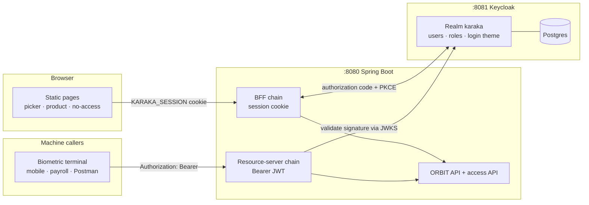
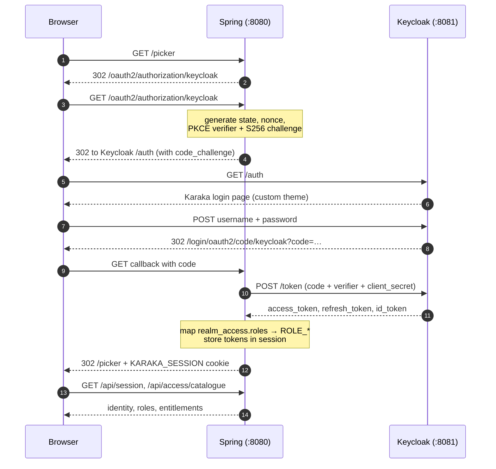
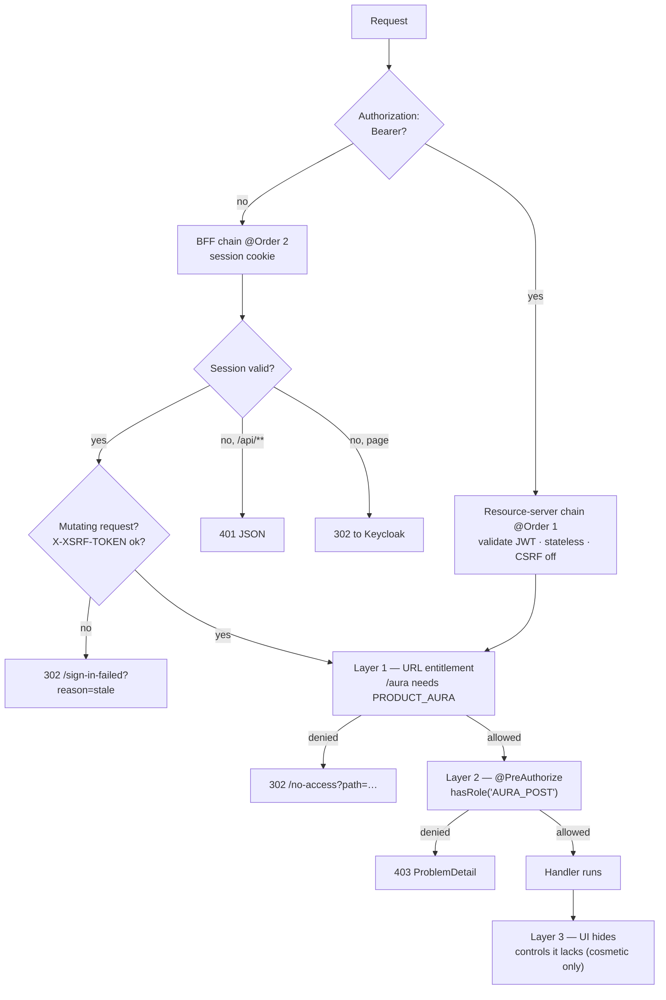
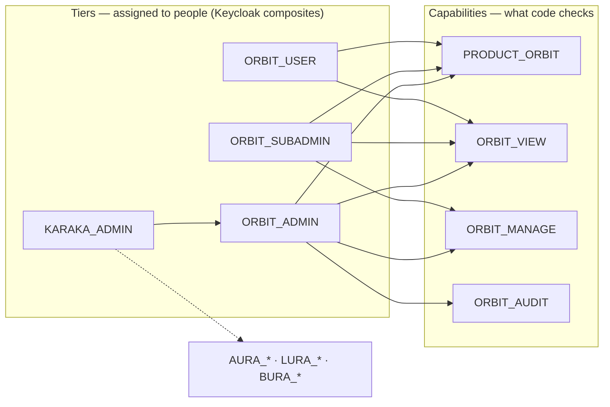
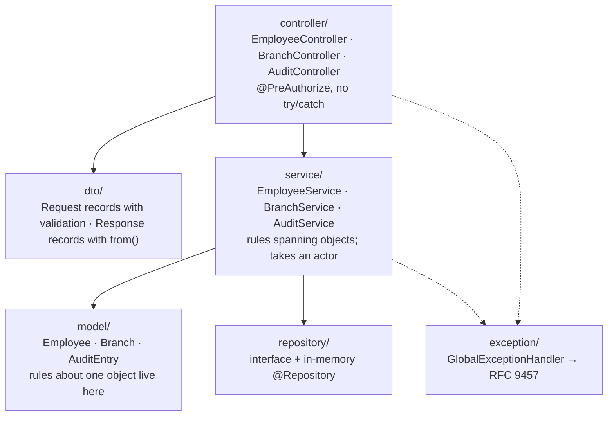

# Karaka — Keycloak SSO across a product suite

Karaka is a suite of peer products sharing **one login** and **one visual system**. The
name comes from Sanskrit grammar: a *kāraka* is "the agent that brings the action about",
the relation everything else in a sentence refers back to.

This repository is a **working end-to-end demonstration** of role-based access control for
that suite, using Keycloak as the identity provider and a Spring Boot
backend-for-frontend. Four products are modelled — ORBIT, AURA, LURA, BURA — of which
ORBIT has a real API. The others exist to show that a user sees exactly their own slice
and nothing more.

| | |
|---|---|
| Keycloak | 26.3 (Quarkus distribution), Postgres 16 |
| Service | Spring Boot 3.5.9 on **Java 25**, Maven |
| Frontend | Static HTML, no framework, no build step |
| Verified | 15/15 access-control checks (see [Verified behaviour](#verified-behaviour)) |

---

## Quick start

```bash
cp .env.example .env          # then change the values
docker compose up -d          # Keycloak + Postgres; realm and theme auto-import
cd service && ./mvnw spring-boot:run
```

Render the realm first, then open <http://localhost:8080/> and sign in:

```bash
cp .env.example .env          # fill in the secrets
./scripts/render-realm.sh     # writes the gitignored realm file
docker compose up -d
```

Every demo account uses whatever you set as `DEMO_USER_PASSWORD`. The realm file
holds no credentials in git — see [docs/DEPLOY.md](docs/DEPLOY.md).

> Keycloak must be reachable **before** the service starts — Spring resolves the OIDC
> discovery document at boot. `docker compose up -d` first, then the service.

| URL | What it is |
|---|---|
| <http://localhost:8080/> | The suite. Redirects to the Keycloak login page |
| <http://localhost:8081/admin> | Keycloak admin console (`admin` / your `.env` password) |
| <http://localhost:8081/realms/karaka/account> | Keycloak's end-user self-service console |

### Demo accounts

| User | Assigned tiers | Can enter |
|---|---|---|
| `ankit` | `KARAKA_ADMIN` | all four products, every capability |
| `harsh` | `ORBIT_SUBADMIN`, `AURA_ADMIN` | ORBIT (no audit trail), AURA (full) |
| `meera` | `ORBIT_USER`, `AURA_SUBADMIN` | ORBIT read-only, AURA post but not close |
| `monti` | `AURA_USER` | AURA read-only, nothing else |
| `farhan` | `LURA_USER`, `BURA_USER` | LURA + BURA read-only |
| `priya` | *none* | nothing — every tile locked |

Sign in as `ankit`, then as `monti`, and compare. That contrast *is* the demo.

---

## HLD — how the pieces fit



**The browser never holds a token.** Spring runs the authorization-code flow, keeps the
access, refresh and ID tokens in the server-side session, and hands the browser only an
`HttpOnly` cookie. That matters more as the suite grows: an access token is valid across
*every* product, so one XSS in the newest, least-reviewed product would otherwise yield a
credential that also opens the others.

**Machines cannot use a cookie**, so `/api/**` also accepts a Bearer JWT and validates it
statelessly. Two callers, two mechanisms, one set of authorization rules.

### Growth path

Today this is one deployable. When products become separate services, the two chains split
cleanly: the BFF chain becomes a gateway's configuration (Spring Cloud Gateway with
`TokenRelay`), and the resource-server chain becomes each product service's. Nothing here
is throwaway.

---

## LLD 1 — the login round trip



**PKCE is mandatory here.** The `karaka-web` client sets
`pkce.code.challenge.method=S256`, and Spring only adds PKCE automatically for *public*
clients — a confidential client must opt in via
`DefaultOAuth2AuthorizationRequestResolver`. Without it every login dies on
`invalid_request: Missing parameter: code_challenge_method`.

**Roles must be mapped twice.** Keycloak nests roles under `realm_access.roles`, which
Spring does not read by default, and its built-in mapper writes them to the *access* token
only — while `oauth2Login` authenticates from the *ID* token. So the realm adds a
realm-role mapper with `id.token.claim=true`, and two classes read them:
`KeycloakRealmRoleMapper` (ID token, browser) and `JwtConverter` (access token, machines).

---

## LLD 2 — three layers of authorization

Every request passes the layers that apply to it. Any one alone leaves a hole.



1. **URL entitlement** — `/aura` requires `PRODUCT_AURA`, so an un-entitled user never
   receives the HTML. Generated from the `SuiteProduct` enum, so a new product cannot be
   added and left unguarded.
2. **Method capability** — `@PreAuthorize` on every controller method. This produces the
   403s the demo shows.
3. **UI affordance** — a withheld control is not rendered. Presentation only; it protects
   nothing on its own, and the pages say so.

### Two 403s, two representations — deliberately

| Origin | Handled by | Response |
|---|---|---|
| URL rule (`authorizeHttpRequests`) | `BrowserAccessDeniedHandler` | 302 to a page that names the product and the missing role |
| `@PreAuthorize` inside a controller | `GlobalExceptionHandler` | RFC 9457 `ProblemDetail` JSON |
| Rejected CSRF token | `BrowserAccessDeniedHandler` | 302 to the retry page — *not* labelled "no access", because it is not a permissions problem |

---

## The role model

Two kinds of realm role. This separation is what lets the model scale past four products.



- **Capabilities** are single concerns: `ORBIT_MANAGE`, `AURA_CLOSE`, `LURA_TRACK`,
  `BURA_ADJUST`. **`@PreAuthorize` references only these.**
- **Tiers** are job-shaped composites: `<PRODUCT>_USER` / `_SUBADMIN` / `_ADMIN`, plus
  `KARAKA_ADMIN`. An administrator assigns one; redefining a tier later changes every
  holder without touching a line of Java.
- **`PRODUCT_*`** entitlements control who may *enter* a product, kept separate from what
  they may *do* inside. Conflating "can see the tile" with "can approve a payment" is what
  becomes unmanageable at ten products.

The sensitive capability is always the one the sub-admin tier withholds: `ORBIT_AUDIT`
(who changed what), `AURA_CLOSE` (irreversible), `LURA_TRACK` (a named person's live
location), `BURA_ADJUST` (altering a biometric record).

---

## Repository layout

```
karaka-ui/
├── docker-compose.yml              Keycloak + Postgres. The service runs from Maven.
├── .env.example                    Copy to .env; every value must change before sharing.
├── keycloak/
│   ├── realm/karaka-realm.json     Source of truth: clients, roles, users, theme.
│   └── themes/karaka/login/        The split-hero login page as a Keycloak theme.
│       ├── login.ftl               Standalone (parent=base) — no PatternFly to fight.
│       ├── theme.properties
│       └── resources/              css · woff2 · favicon
└── service/
    ├── pom.xml
    └── src/main/
        ├── java/com/karaka/
        │   ├── config/             SecurityConfig, role mappers, CSRF, routing, Clock
        │   ├── demo/               SuiteProduct catalogue + live access probe
        │   ├── identity/           /api/session, actor resolution
        │   └── orbit/              the one real product — see below
        └── resources/
            ├── application.yml
            └── static/             picker · product · no-access · sign-in-failed
```

### The ORBIT slice — layering used everywhere



Dependencies point one way. A controller never touches a repository; a service never reads
the security context — the `actor` is passed in, which keeps the service callable from a
job or an import.

**Rules live as close to the data as possible.** `Employee.exitOn(date)` sets the status
*and* the exit date together and refuses to exit twice, so no caller can produce a record
marked exited with no leaving date. The service owns only what spans objects: "the branch
must exist", "the email must be unique", "every change is audited".

Conventions: no Lombok, constructor injection only, records for DTOs, `java.time`
throughout with an injected `Clock` so tests can pin "today". Repository method names are
the ones Spring Data would derive, so swapping the in-memory store for JPA is
`extends JpaRepository<Employee, String>` plus deleting one class.

---

## API

All under `/api`. Browser calls authenticate by cookie; machines by Bearer JWT.
Mutating requests need the `XSRF-TOKEN` cookie echoed as `X-XSRF-TOKEN`.

| Method | Path | Capability |
|---|---|---|
| GET | `/api/session` | authenticated |
| GET | `/api/access/catalogue` | authenticated |
| POST | `/api/access/probe/{product}/{capability}` | that capability |
| GET | `/api/employees?search=&branch=&status=` | `ORBIT_VIEW` |
| GET | `/api/employees/{id}` | `ORBIT_VIEW` |
| POST | `/api/employees` | `ORBIT_MANAGE` |
| PUT | `/api/employees/{id}` | `ORBIT_MANAGE` |
| POST | `/api/employees/{id}/exit` | `ORBIT_MANAGE` |
| PATCH | `/api/employees/{id}/status` | `ORBIT_MANAGE` |
| GET | `/api/branches` | `ORBIT_VIEW` |
| GET | `/api/audit?limit=` | `ORBIT_AUDIT` |

Errors are RFC 9457, with field messages written for a person:

```json
{ "type": "https://karaka.dev/problems/duplicate-email",
  "title": "Email already in use", "status": 409,
  "errors": { "email": "Already registered to another employee" } }
```

`POST /api/employees/{id}/exit` rather than `DELETE`: the record is kept, which is the
entire purpose of a register.

---

## Verified behaviour

Page access — 403/302 means refused at the URL, before any HTML is served:

| User | ORBIT | AURA | LURA | BURA |
|---|---|---|---|---|
| ankit | 200 | 200 | 200 | 200 |
| harsh | 200 | 200 | — | — |
| meera | 200 | 200 | — | — |
| monti | — | 200 | — | — |
| farhan | — | — | 200 | 200 |
| priya | — | — | — | — |

Admin vs sub-admin on real ORBIT endpoints — the distinction the tier model exists for:

| User | list employees | read audit | create employee |
|---|---|---|---|
| ankit (admin) | 200 | **200** | 201 |
| harsh (sub-admin) | 200 | **403** | 201 |
| meera (user) | 200 | **403** | **403** |

Also verified: CSRF-less POST → 403; wrong `_csrf` → refused *and* still signed in;
invalid Bearer → 401; machine token without `ORBIT_MANAGE` → 403; logout ends the Keycloak
SSO session so the next visit shows the login form; validation → 400 with field errors;
duplicate email → 409 (case-insensitive); unknown branch → 422.

---

## Operating notes

**The realm JSON is the source of truth.** `--import-realm` uses `IGNORE_EXISTING`, so
edits to `karaka-realm.json` do nothing until the volume is dropped:

```bash
docker compose down -v && docker compose up -d
```

Changes made in the admin console live only in Postgres and are discarded by that command.
Use the console to explore and debug; make permanent changes in the JSON. To capture
console changes:

```bash
docker exec karaka-keycloak /opt/keycloak/bin/kc.sh export --realm karaka --file /tmp/e.json
docker cp karaka-keycloak:/tmp/e.json ./karaka-export.json
```

**Keycloak's Events screen is empty until you enable it** — Realm settings → Events →
*Save events*. It is where `invalid_code`, `already_logged_in` and
`invalid_user_credentials` appear, and the fastest way to diagnose a failed login.

**A stale browser session survives a restart.** Keycloak's SSO cookie outlives the app's
session, so after restarting you may be signed straight back in (`already_logged_in`), or a
half-finished login may fail with `invalid_code`. Both land on `/sign-in-failed`, which
offers a clean retry. A private window avoids it entirely.

---

## Before this goes anywhere shared

- **Every credential in this repo is a dev placeholder** — `.env`, and the two client
  secrets in `karaka-realm.json`. Rotate all of them; the client secret must match in both
  places.
- **Keycloak runs in `start-dev`**: no TLS, relaxed hostname checks, no theme caching.
  Production needs `start`, a real `KC_HOSTNAME`, TLS, and SMTP for password reset.
- **Set `KARAKA_COOKIE_SECURE=true`** once behind TLS.
- **The ORBIT store is in memory.** Data resets on restart; `DataSeeder` refills it.
- **Sessions are in-process.** More than one instance needs shared session storage.

### Known gaps

- No automated tests. Behaviour above was verified by HTTP probing, which is how a CSRF
  bug in the form-submission path survived several rounds of green API checks.
- `docs/AUTH.md` and a Postman collection are referenced in conversation but not written.
- Design-system assets exist in two places: `.claude/skills/karaka-tokens/reference/`
  (the skill's own copy, and the source of truth) and
  `service/src/main/resources/static/shared/` (what is actually served). The served
  copy is derived by hand, so it can still drift.
- Unused component classes remain in `static/shared/karaka.css`. They are the design
  system's published API rather than dead code, but nothing in this release uses the table,
  modal, or toolbar styles.
